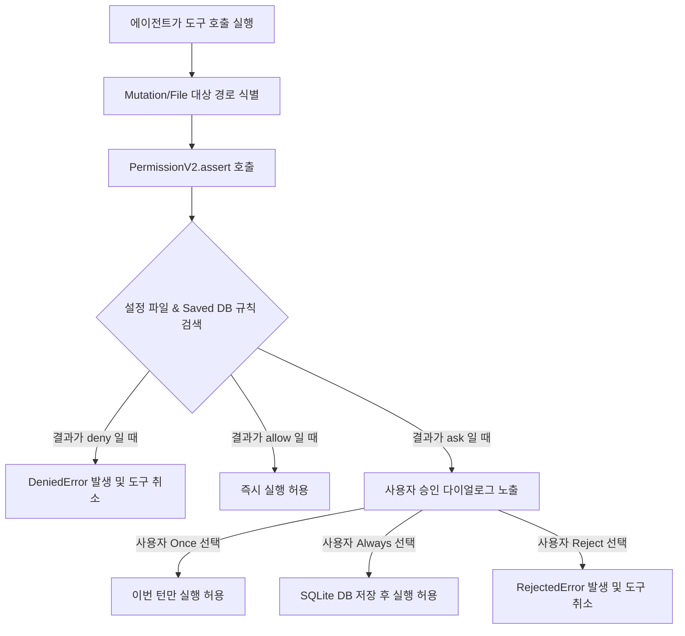

# OpenCode 권한 관리(Permission) 시스템 분석 및 설정 가이드

OpenCode는 에이전트(LLM)가 시스템 자원(파일 읽기/쓰기, 명령어 실행 등)에 접근할 때 안전성과 제어를 제공하기 위해 정밀한 권한 관리 프레임워크를 탑재하고 있습니다. 이 문서에서는 OpenCode의 권한 관리 아키텍처와 `opencode.json`을 통한 설정 방법을 상세히 정리합니다.

---

## 1. 권한 관리 아키텍처 개요

OpenCode의 권한 검증 흐름은 크게 **설정 파일 파싱**, **런타임 규칙 평가**, **사용자 동의 요청(Promoting/Asking)**, 그리고 **영구 승인 보관(Saved Rules)** 단계로 나뉩니다.

### 1) 핵심 소스 코드 링크
* **권한 처리 서비스**: [packages/core/src/permission.ts](file:///D:/AREA51/workspace/opencode/packages/core/src/permission.ts)  
  * `PermissionV2.Service` 클래스에서 `assert`, `ask`, `reply` 등의 로직을 수행합니다.
* **권한 데이터 스키마**: [packages/core/src/permission/schema.ts](file:///D:/AREA51/workspace/opencode/packages/core/src/permission/schema.ts)  
  * `Rule` 및 `Ruleset` 객체 타입을 정의합니다. `effect` 타입은 `"allow" | "deny" | "ask"` 중 하나입니다.
* **설정 관리 엔진**: [packages/core/src/config.ts](file:///D:/AREA51/workspace/opencode/packages/core/src/config.ts)  
  * `opencode.json`에서 전역 `permissions` 및 에이전트별 설정을 파싱합니다.
* **설정 동기화 플러그인**: [packages/core/src/config/plugin/agent.ts](file:///D:/AREA51/workspace/opencode/packages/core/src/config/plugin/agent.ts)  
  * 파싱된 설정을 런타임 에이전트 객체(`agent.permissions`)에 주입 및 병합합니다.
* **영구 승인 저장소**: [packages/core/src/permission/saved.ts](file:///D:/AREA51/workspace/opencode/packages/core/src/permission/saved.ts)  
  * 사용자가 대화 인터페이스에서 "Always Allow"를 누른 권한 규칙들을 로컬 SQLite DB에 저장하고 병합합니다.
* **와일드카드 매처**: [packages/core/src/util/wildcard.ts](file:///D:/AREA51/workspace/opencode/packages/core/src/util/wildcard.ts)  
  * 패턴 매칭(`*`, `?`) 시 사용하는 유틸리티 함수입니다.

### 2) 권한 동작 방식 흐름도



---

## 2. `opencode.json` 권한 설정 가이드

OpenCode는 프로젝트의 루트 디렉토리에 위치한 `opencode.json`, `opencode.jsonc` 혹은 글로벌 홈 경로 `~/.config/opencode/opencode.json` 설정 파일로부터 권한 정책을 읽어옵니다.

### 1) 설정 구조 예시
`opencode.json`에서 `"permission"` 속성을 통해 정책을 선언합니다.

```json
{
  "$schema": "https://opencode.ai/config.json",
  "username": "developer",
  "model": "anthropic/claude-3-5-sonnet",
  
  "permission": {
    "edit": "deny",
    "bash": { 
      "git *": "allow", 
      "rm -rf *": "deny", 
      "*": "ask" 
    },
    "external_directory": { 
      "~/secrets/**": "deny", 
      "*": "allow" 
    }
  },

  "agent": {
    "expert-coder": {
      "model": "anthropic/claude-3-5-sonnet",
      "permission": {
        "edit": "ask",
        "bash": "allow"
      }
    }
  }
}
```

### 2) 설정 규칙 및 주의사항
1. **규칙 평가 우선순위 (Last Matching Wins)**:
   * OpenCode는 규칙셋 배열을 순회할 때 **마지막으로 일치하는 규칙**을 적용합니다.
   * 따라서 넓은 범위의 매칭 패턴(예: `*`)을 객체 상단에 배치하고, 좁고 세부적인 예외 규칙들을 하단에 배치해야 합니다.
2. **도구 차단 매커니즘 (Tool Masking)**:
   * 특정 도구 권한 전체가 거부(`"*": "deny"`) 처리되어 있으면, LLM에 노출하는 도구 정의 자체에서 해당 도구를 삭제합니다 ([registry.ts](file:///D:/AREA51/workspace/opencode/packages/core/src/tool/registry.ts#L131-L134))합니다. 즉, 에이전트는 해당 기능의 존재조차 모르게 되므로 효율적인 프롬프트 관리가 가능합니다.
3. **전역 설정 vs 에이전트 설정 오버라이드**:
   * 최상위 `"permission"`은 모든 대화 세션에 기본 적용됩니다.
   * 특정 에이전트 인스턴스 내부의 `"agent[name].permission"` 필드가 정의되면 해당 에이전트 세션의 도구 실행에 대해서는 전역 설정보다 에이전트 수준의 세밀한 룰이 우선 적용됩니다.

---

## 3. 권한 항목(Known Permission Keys) 상세 안내

| 권한 키 (Key) | 대상 도구 및 리소스 패턴 예시 | 상세 설명 |
| :--- | :--- | :--- |
| **`read`** | 파일 경로 (예: `src/main.ts`, `*`) | 파일 읽기(Read File) 요청 시 검사합니다. |
| **`edit`** | 파일 경로 (예: `src/utils/*`) | 파일 쓰기 및 수정(Write, Edit, Apply Patch) 요청 시 검사합니다. |
| **`glob`** | 파일 패턴 (예: `**/*.ts`) | 디렉토리 파일 glob 검색 도구 실행 시 검사합니다. |
| **`grep`** | 검색 쿼리 패턴 (예: `TODO`) | ripgrep 검색 도구 호출 시 검사합니다. |
| **`list`** | 디렉토리 경로 (예: `src/`) | 디렉토리 리스팅 권한입니다. |
| **`bash`** | 명령어 문자열 (예: `npm install`) | 샌드박스 쉘 터미널 실행 명령을 검사합니다. |
| **`unsandboxed`**| 명령어 문자열 (예: `git commit`) | 샌드박스 밖(로컬 환경)에서 직접 쉘 명령을 구동할 때 검사합니다. |
| **`external_directory`** | 절대 경로 패턴 (예: `~/secrets/**`) | 프로젝트 Workspace 루트 바깥의 절대 경로에 있는 디렉토리를 접근/수정하려고 할 때 사전 차단 혹은 승인을 요청하는 검사 항목입니다. |
| **`todowrite`** | `*` (pattern not supported) | 현재 세션 진행 작업을 적는 TODO 보드 업데이트 권한입니다. |
| **`question`** | `*` (pattern not supported) | LLM이 사용자에게 터미널/에디터 UI에서 질문을 던질 때의 승인 여부입니다. |
| **`webfetch`** | URL 패턴 (예: `https://api.github.com/*`) | 외부 웹 사이트 정보를 가져올 때 사용됩니다. |
| **`websearch`** | 검색 검색어 (예: `*`) | 웹 브라우저 검색 API를 이용해 검색을 보낼 때의 권한입니다. |
| **`skill`** | 스킬명 (예: `antigravity-guide`) | 외부에 제공되는 OpenCode 스킬 파일을 호출하고 주입할 때 검사합니다. |

---

## 4. 매칭 및 필터링 메커니즘 디테일

### 1) 와일드카드 매칭 구현 ([wildcard.ts](file:///D:/AREA51/workspace/opencode/packages/core/src/util/wildcard.ts))
OpenCode가 자원을 매칭할 때 다음 변환을 거쳐 정규식으로 평가합니다.
* 모든 윈도우 스타일 백슬래시(`\`)는 리눅스 포워드 슬래시(`/`)로 일괄 노멀라이즈됩니다.
* `*` 와일드카드는 정규식의 `.*`으로 변환됩니다.
* `?` 와일드카드는 정규식의 `.`으로 변환됩니다.
* 매칭은 정규식 시작(`^`)과 끝(`$`)을 지정하여 부분 매칭이 아닌 **완전 일치** 방식을 강제합니다.
* Windows OS 환경에서는 대소문자를 구분하지 않도록(Case Insensitive, `si` 플래그) 동작하며, POSIX 환경에서는 대소문자를 구분합니다.

### 2) 설정 수정 후 적용
* `opencode.json`의 변경 사항은 OpenCode 구동 시 최초 1회만 로드(캐싱)됩니다.
* **설정을 수정한 후에는 반드시 OpenCode 세션 프로세스를 완전히 종료하고 재시작(Quit and Restart)**해야만 새 설정이 프로파일에 적용됩니다.
